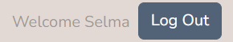

# Testing

## Table of content
- [User Stories](#user-stories)
- [Manual Testing](#manual-testing)
- [Validation Testing](#validation-testing)
- [Automated Testing](#automated-testing)
- [Bugs](#bugs)

### User Stories

Below are the user stories with their corresponding test validation steps.

---

#### User Story 1  
**As a visitor, I can read blog posts without an account so that I can learn from others' experiences**

| Acceptance Criteria                                           | Steps to Test                                            | Expected Outcome                                                   | Pass/Fail | Screenshot |
|---------------------------------------------------------------|-----------------------------------------------------------|----------------------------------------------------------------------|-----------|------------|
| Posts are visible without login                               | Visit the blog page while logged out                      | Posts are displayed publicly                                        |  Pass ✅        |            |
| Each post displays title, author, date, and content           | View individual post page                                 | Title, author, date, and content are shown                          |  Pass ✅        |            |
| Users are prompted to register when attempting to comment or like | Try to comment or like a post while logged out            | Redirected to login/register or shown prompt                        |  Pass ✅        |            |

---

#### User Story 2  
**As a visitor, I can view how the platform works so that I can decide whether I want to join**

| Acceptance Criteria                                           | Steps to Test                                            | Expected Outcome                                                   | Pass/Fail | Screenshot |
|---------------------------------------------------------------|-----------------------------------------------------------|----------------------------------------------------------------------|-----------|------------|
| A public “How It Works” page exists                           | Navigate to "How It Works" page                           | Page is accessible without login                                    |   Pass ✅       |            |
| Page explains the concept of mutual dog care with examples    | Read the content on the page                              | Explanation includes examples of how care exchange works           | Pass ✅         |            |
| Call-to-action buttons to register or explore more            | Look for call-to-action buttons                           | Buttons are clearly visible and link to signup or explore sections |    Pass ✅      |             |

---

#### User Story 3  
**As a visitor, I can sign up for an account so that I can access full functionality of the community**

| Acceptance Criteria                                           | Steps to Test                                            | Expected Outcome                                                   | Pass/Fail | Screenshot |
|---------------------------------------------------------------|-----------------------------------------------------------|----------------------------------------------------------------------|-----------|------------|
| Sign-up form includes fields for name, email, password        | Go to registration page                                   | All fields are present and required                                | Pass ✅         |            |
| Confirmation  after registration                 | Look for your name on the page                           | View username on top of the page                    |   Pass ✅       |             |

---

#### User Story 4  
**As a dog owner, I can post a request for dog-sitting help so that I can find someone to care for my dog when I need it**

| Acceptance Criteria                                           | Steps to Test                                            | Expected Outcome                                                   | Pass/Fail | Screenshot |
|---------------------------------------------------------------|-----------------------------------------------------------|----------------------------------------------------------------------|-----------|------------|
| Post includes location, date(s), and a description            | Fill out new request form                                 | All fields are available and can be submitted                      | Pass ✅         |           |
| Other users can view and respond to the request               | Log in with another user and view posts                   | Request is visible and interaction options are available           |   Pass ✅       |            |
| User can edit or delete the request                           | Open own post                                             | Edit and delete buttons are visible                                | Pass ✅         |            |

---

#### User Story 5  
**As a dog owner, I can offer to help others with their dogs so that I can support the community and build trust**

| Acceptance Criteria                                           | Steps to Test                                            | Expected Outcome                                                   | Pass/Fail | Screenshot |
|---------------------------------------------------------------|-----------------------------------------------------------|----------------------------------------------------------------------|-----------|------------|
| Users can respond to help requests                            | Click on another user’s post                              | Option to comment is shown                    |   Pass ✅       |            |
| Users can like posts as a way to show support                 | Click like on a post                                      | Like is registered and visually updated                            |Pass ✅          |            |

---

#### User Story 6  
**As a registered user, I can comment on blog posts so that I can join the conversation**

| Acceptance Criteria                                           | Steps to Test                                            | Expected Outcome                                                   | Pass/Fail | Screenshot |
|---------------------------------------------------------------|-----------------------------------------------------------|----------------------------------------------------------------------|-----------|------------|
| Comments appear in reverse chronological order                        | View comments on a post                                   | Comments are listed with the newest at the top                           |   Pass ✅       |            |
| Only logged-in users can comment                              | Attempt to comment while logged out                       | Redirected to login or shown prompt                                | Pass ✅         |            |

---

#### User Story 7  
**As the author of a post, I can see edit and delete buttons on my own posts so that I can manage and update my content when needed**

| Acceptance Criteria                                           | Steps to Test                                            | Expected Outcome                                                   | Pass/Fail | Screenshot |
|---------------------------------------------------------------|-----------------------------------------------------------|----------------------------------------------------------------------|-----------|------------|
| Edit and delete buttons are only visible to the post author   | Log in as another user and view someone else's post       | No edit or delete options shown                                    |  Pass ✅        |            |
| Users can edit or delete their own posts at any time          | Log in as author, open own post                           | Edit and delete options are shown                                  |  Pass ✅        |            |
| Changes are immediately reflected on the platform             | Edit content and save                                     | Updated content appears instantly                                  | Pass ✅         |            |

---

#### User Story 8  
**As an admin, I can view all posts so that I can monitor the content shared on the platform**

| Acceptance Criteria                                           | Steps to Test                                            | Expected Outcome                                                   | Pass/Fail | Screenshot |
|---------------------------------------------------------------|-----------------------------------------------------------|----------------------------------------------------------------------|-----------|------------|
| Admin has access to a dashboard with all user posts           | Log in as admin and access admin dashboard                | All user posts are visible                                         | Pass ✅         |            |

---

#### User Story 9  
**As an admin, I can delete inappropriate or harmful content so that the platform remains safe and respectful**

| Acceptance Criteria                                           | Steps to Test                                            | Expected Outcome                                                   | Pass/Fail | Screenshot |
|---------------------------------------------------------------|-----------------------------------------------------------|----------------------------------------------------------------------|-----------|------------|
| Admin can delete any post                                     | Log in as admin and delete any user’s post                | Post is removed                         |   Pass ✅        |            |
| A confirmation message appears before a post gets deleted                | Click delete on a post                                    | Prompt confirms the action                                        |   Pass ✅        |             |
| Deleted posts are removed immediately from public view        | Confirm deletion                                          | Post no longer visible to any user                                |  Pass ✅         |             |

## Manual Testing

### Responsive Design Testing

The application was tested across multiple screen sizes, with Chrome DevTools, and with [Am I Responsive](http://ami.responsivedesign.is/).

✅ Confirmed that all pages display as intended on:
- Mobile (e.g. Samsung Galaxy A51, Iphone 15)
- Tablet (e.g. iPad)
- Laptop (e.g. Asus Vivobook)

All elements (cards, buttons, forms) stack or resize as expected for readability and usability.

*Asus Vivobook*  

*Samsung Galaxy A51*  

  

---

### Browser Compatibility

The site was tested and works as expected in the following browsers:

| Browser         | Result |
|-----------------|--------|
| Google Chrome   |✅ Pass |
| Mozilla Firefox |✅ Pass |
| Microsoft Edge  |✅ Pass |
| Safari          |✅ Pass |

There were no styling or functionality issues detected in these browsers.

---
### Navigation and Button Functionality Testing

The following table documents manual testing of navigational links and interactive buttons across the site. Each feature was tested to ensure it leads to the correct page, performs its expected action, and provides user feedback when necessary.

| Area                     | Element                            | Action/Expected Result                                                  | Status |
|--------------------------|-------------------------------------|-------------------------------------------------------------------------|--------|
| **Navbar**               | Logo                                | Redirects to homepage                                                  | ✅     |
|                          | All Posts                           | Opens the page listing all posts                                       | ✅     |
|                          | Add Post                            | Opens the form to create a new post                                    | ✅     |
|                          | Log In                              | Opens the login form                                                   | ✅     |
|                          | Sign Up                             | Opens the registration form                                            | ✅     |
|                          | Log Out                             | Logs out user and show confirmation page                               | ✅     |
| **Footer**               | Facebook icon                       | Opens Facebook page in new tab                                         | ✅     |
|                          | Twitter (X) icon                    | Opens Twitter/X page in new tab                                        | ✅     |
|                          | YouTube icon                        | Opens YouTube page in new tab                                          | ✅     |
|                          | Instagram icon                      | Opens Instagram page in new tab                                        | ✅     |
| **Homepage**             | View All Posts button               | Redirects to all posts page                                            | ✅     |
|                          | Create a Post button                | Opens post creation form (or log in form if not logged in)             | ✅     |
| **Post List Page**       | Add New Post button                 | Opens post creation form                                               | ✅     |
|                          | Edit (own post only)                | Opens post editing form                                                | ✅     |
|                          | Delete (own post only)              | Opens delete confirmation modal                                        | ✅     |
| **Single Post Page**     | Edit button                         | Opens edit form for current post                                       | ✅     |
|                          | Delete button                       | Opens delete confirmation modal                                        | ✅     |
|                          | Back to Posts button                | Returns to all posts page                                              | ✅     |
|                          | Post Comment form                   | Submits comment under the post                                         | ✅     |
|                          | Like button (heart icon)           | Increments/decrements like count                                       | ✅     |
| **Delete Confirmation**  | Yes, delete post button             | Deletes the post and redirects to post list                            | ✅     |
|                          | Cancel button                       | Cancels deletion and stays on current page                             | ✅     |
| **Log out confirmation** | Go to homepage                      | Redirects to homepage                                                  | ✅     |
|                          | Log back in                         | Redirects to Log in form                                               | ✅     |
| **404 Page**             | Back to homepage button             | Redirects to homepage when page is not found                           | ✅     |

**Status** ✅ = Working as expected

### Validation testing
#### HTML

The live rendered pages were validated using the [W3C HTML Validator](https://validator.w3.org/) by entering the public URLs.  
✅ No critical errors found. This approach avoids false errors caused by Django template syntax (e.g., `` tags).

*Homepage*  

*Post list*  

*Post details*  
  
During HTML validation, a warning appeared regarding the `
` tag and the trailing slash (`/`). However, inspection in browser DevTools shows the tag is rendered correctly as `
` without a trailing slash.

This indicates that the warning is a false positive and does not affect the rendered page.

*Log in*  

*Sign up*  

#### CSS Validation

The main stylesheet (`base.css`) was tested using the [W3C CSS Validator](https://jigsaw.w3.org/css-validator/).  
✅ Passed without errors.

---
### Lighthouse Performance Testing

The Care4Dogs homepage was tested with Google Lighthouse, achieving high scores across key categories including Performance, Accessibility, Best Practices, and SEO.

## Automated Testing

### Form Validation Tests

These automated tests ensure that key form validation logic works as expected. All tests were written using Django’s TestCase framework and can be run with `python manage.py test`.

#### ✅ CommentForm

| Test Name           | Purpose                                  | Result |
|---------------------|-------------------------------------------|--------|
| test_form_is_valid  | Checks that the comment form validates when content is provided | ✅ Passes |

#### ✅ DogCarePostForm

| Test Name                     | Purpose                                                                 | Result |
|-------------------------------|-------------------------------------------------------------------------|--------|
| test_valid_form               | Ensures form passes with all required fields                           | ✅ Passes |
| test_missing_title            | Ensures form fails if title is empty                                   | ✅ Passes |
| test_missing_dates            | Ensures form fails if date_from or date_to are missing                 | ✅ Passes |
| test_date_to_before_date_from| Ensures form fails if end date is before start date, using custom clean() | ✅ Passes |

---

> All form validation tests passed successfully as of `2025-06-30`. The forms now include custom validation logic for date order.

---

### View Tests

The image shows how a test user and a test post are created, including an empty image file.

Purpose: To verify that the views work correctly without triggering Cloudinary errors.

✅ Result: All view tests passed:
- The post list view loads successfully.
- Login is required to access the post creation view.

## Bugs

### ❗ Mixed Content Warning (Resolved)

During earlier testing, a mixed content warning appeared in the browser console:

This warning was caused by external resources (such as images from Cloudinary) being loaded via `http://` URLs instead of secure `https://` URLs. Modern browsers often upgrade such requests automatically, so the issue did not affect the functionality or security of the live application.

### ✅ Resolution

The root cause was identified in how Cloudinary returned image URLs during post creation. The solution involved explicitly configuring Cloudinary to use secure `https://` URLs, eliminating the mixed content warnings.

Here is a screenshot demonstrating the resolved state with no warnings:

---

### Other Bugs & Issues Encountered

Throughout development, a number of bugs were identified and resolved. Here are some examples:

- **Post images not displaying correctly**  
    - The Cloudinary image didn’t appear on cards due to missing `.url` in the template.  
  ✅ Fixed by updating `{{ post.image }}` to `{{ post.image.url }}`.

- **No confirmation before deleting a post**  
    - Clicking "Delete" removed posts immediately without warning.  
  ✅ Added an inline confirmation prompt using `onclick="return confirm(...);"`.

- **Footer not sticking to the bottom**  
    - Footer floated mid-page when content was short.  
  ✅ Fixed using flex layout on `body` and `main { flex: 1; }`.

- **Validation errors due to void elements**  
    - HTML Validator flagged trailing slashes as problematic.  
  ✅ Corrected all void elements to the proper HTML5 format.  
  ℹ️ Some slashes might still be added automatically by services like Cloudinary.

- **Comment form overlapping with footer on mobile**  
    - Overlap issue fixed by adjusting spacing and layout.

- **Heroku login blocked by MFA**  
    - Multi-Factor Authentication issues prevented access to logs and deployment.  
  ✅ Resolved by contacting Heroku support and adjusting MFA settings temporarily.

